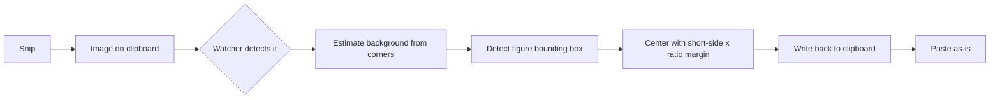

[日本語](README.md) | **English**

# even-margins


A daemon that watches the clipboard and automatically evens out the top/bottom/left/right margins of every new image. Just snip — the margins are balanced for you.

Figures cropped with `Win+Shift+S` and the like tend to end up with uneven margins. even-margins runs in the background, watches the clipboard, and the moment an image arrives it detects the figure, re-centers it with an equal margin on every side, and writes the result back. Then you just paste — no hotkey.

## How it works



## Setup

```
pip install -r requirements.txt
```

## Usage

```
python trim.py
```

It runs in the background and watches the clipboard. When a new image arrives (e.g. from a snip), it normalizes the margins automatically and writes the result back. Press `Ctrl+C` to quit.

The image it writes back is excluded by both its signature and the clipboard sequence number, so the figure never keeps shrinking from re-processing.

## Configuration

Edit `config.toml`.

| Key | Default | Description |
|---|---|---|
| `ratio` | `0.05` | Margin = figure's short side × this ratio |
| `poll_interval` | `0.3` | Clipboard polling interval (seconds) |
| `tolerance` | `20` | Background match tolerance (max per-channel RGB diff) |
| `corner_size` | `8` | Side length (px) of the corner sampling boxes |

## Troubleshooting

`diagnose.py` walks each stage — grab, background estimate, detection, normalization, write-back — independently of the watcher. Copy a figure first, then run it.

```
python diagnose.py
```

## License

MIT © 2026 4ltena
