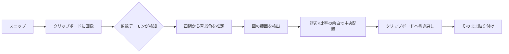

**日本語** | [English](README.en.md)

# even-margins


クリップボードを監視し、新しい画像が入るたびに上下左右の余白を自動で均等化して書き戻す常駐ツール。スニップするだけで余白がそろう。

`Win+Shift+S` などで切り抜いた図は、上下左右の余白が不均一になりがち。even-margins は常駐してクリップボードを監視し、画像が入った瞬間に図の範囲を検出して、全周そろった余白で中央に置き直してクリップボードへ戻す。あとは貼り付けるだけ。ホットキーは押さない。

## 仕組み



## セットアップ

```
pip install -r requirements.txt
```

## 使い方

```
python trim.py
```

起動すると常駐し、クリップボードを監視する。スニップなどで新しい画像が入ると、自動で余白を均等化して書き戻す。`Ctrl+C` で終了する。

自分が書き戻した画像はシグネチャとシーケンス番号で除外するため、再処理で図が縮み続けることはない。

## 設定

`config.toml` で変更する。

| キー | 既定値 | 説明 |
|---|---|---|
| `ratio` | `0.05` | 余白 = 図の短辺 × この比率 |
| `poll_interval` | `0.3` | クリップボード監視の間隔（秒） |
| `tolerance` | `20` | 背景判定の許容誤差（RGB 各チャンネル差の上限） |
| `corner_size` | `8` | 四隅サンプル領域の一辺 px |

## うまく動かないとき

`diagnose.py` を使うと、監視に依存せず取得→背景推定→検出→整形→書き戻しの各段階を確認できる。整えたい図をコピーしてから実行する。

```
python diagnose.py
```

## ライセンス

MIT © 2026 4ltena
